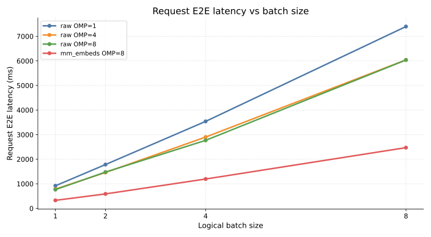
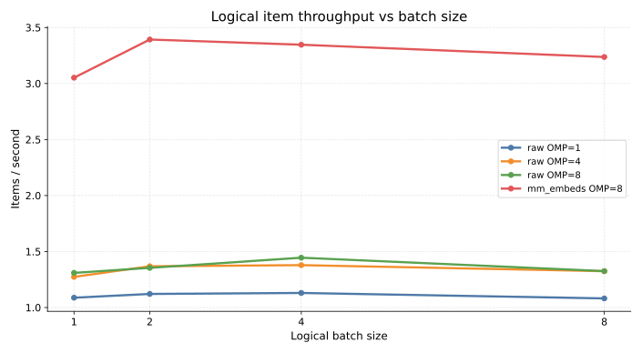
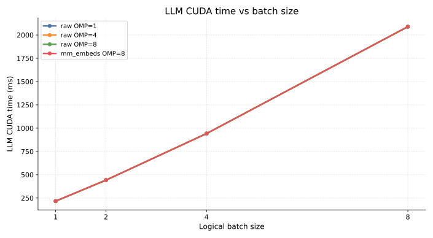
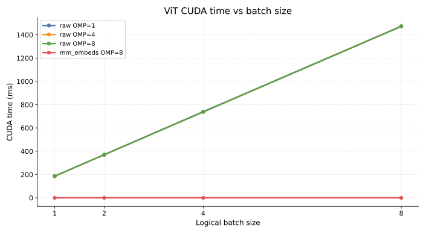
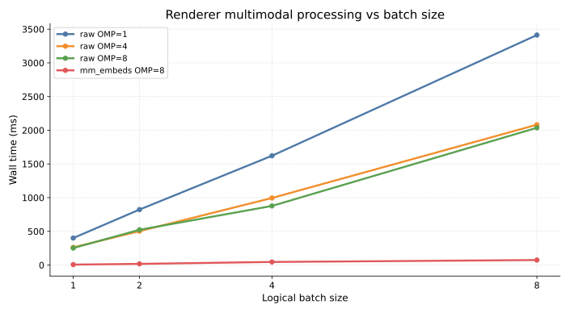
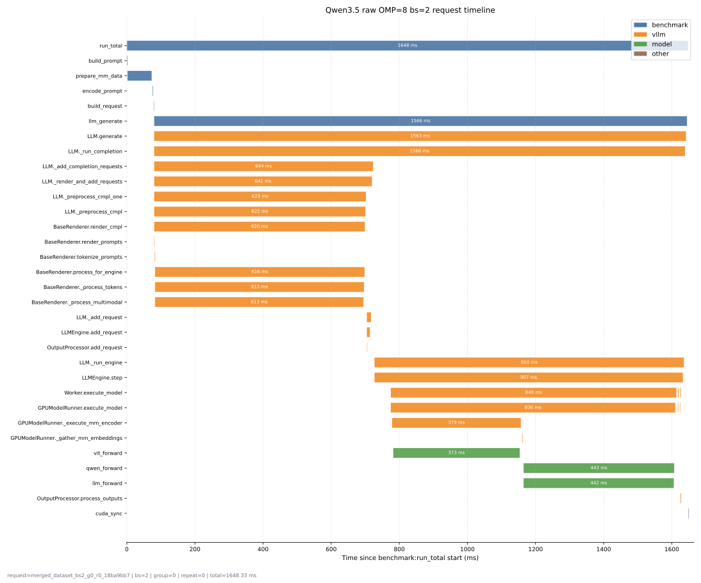
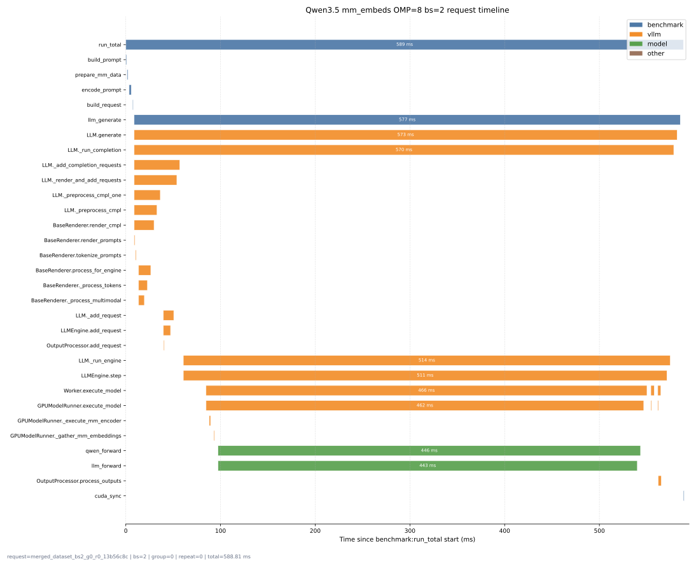

# Qwen3.5 enable_mm_embeds 性能对比报告

本文记录一次针对 `/workspace/project/RL-learning/vllm-test/scripts/benchmark_qwen35_mm_merged_request.py` 的性能扫测，目标是比较两类输入路径：

- 原图输入：每条样本传真实图片，由 vLLM 做多模态预处理并执行 ViT。
- `enable_mm_embeds` 输入：每条样本传预计算好的 `image_embeds` 和 `image_grid_thw`，跳过 ViT。

本次输出目录：

```text
/workspace/project/RL-learning/vllm-test/outputs/perf_report_20260620_181529
```

汇总文件：

```text
/workspace/project/RL-learning/vllm-test/outputs/perf_report_20260620_181529/combined_summary.csv
/workspace/project/RL-learning/vllm-test/outputs/perf_report_20260620_181529/combined_summary.md
```

## 快速结论

如果只看结论，可以按下面三点理解这份报告：

- 原图输入的 prefill 主要耗时来自三块：vLLM renderer 多模态预处理 `renderer_mm`、视觉 encoder `vit`、语言模型 `llm_forward`。
- 提高 `OMP_NUM_THREADS` 主要优化 `renderer_mm`。本次实验中，原图路径从 `OMP=1` 提升到 `OMP=8` 后，`renderer_mm_ms` 明显下降，而 `vit_ms` 和 `llm_ms` 基本不变。
- 启用 `enable_mm_embeds` 后，输入从原始图片变成预计算好的 `image_embeds`，因此可以绕过 ViT，并显著减少 renderer 多模态处理开销；但这不再代表完整图片端到端链路，更适合用来分析 ViT 之后的 vLLM/LLM 执行成本。

阅读建议：

- 先看“核心结果”表，确认各 run 和 batch size 下的主要数值。
- 再看“指标趋势图”，理解 batch size、OMP 和 `enable_mm_embeds` 对趋势的影响。
- 如果要解释 `e2e_ms` 为什么大于 `renderer_mm_ms + vit_ms + llm_ms`，看“请求时间线”。时间线能展示请求进入 vLLM 后的 preprocess、engine step、worker/model execution 等阶段。

## 实验配置

基础命令等价于：

```bash
OMP_NUM_THREADS=<1|4|8> \
python /workspace/project/RL-learning/vllm-test/scripts/benchmark_qwen35_mm_merged_request.py \
  --dataset-jsonl /workspace/project/RL-learning/vllm-test/data/alpamayo_qwen35_200/dataset.jsonl \
  --dataset-limit 8 \
  --batch-sizes 1,2,4,8 \
  --repeats 1 \
  --warmup 1 \
  --disable-enforce-eager \
  --input-mode tokenized \
  --enable-vllm-python-profile \
  --output-dir <output-dir>
```

`enable_mm_embeds` 对照组额外增加：

```bash
--enable-mm-embeds
```

这要求 JSONL 每条数据包含：

- `image_embeds`：对应 `.pt` 文件路径。
- `image_grid_thw`：对应 `.pt` 文件路径。

当前数据集 `/workspace/project/RL-learning/vllm-test/data/alpamayo_qwen35_200/dataset.jsonl` 已包含上述字段。每条样本仍保留原始 prompt；脚本在 merged-request 模式下把同一个 logical batch 的文本拼成一个 prompt，把图片或 embedding 合并成一次 vLLM 请求。

## 核心结果

| run | bs | prompt_tokens | e2e_ms | per_item_ms | items/s | vit_ms | llm_ms | model_ms | renderer_mm_ms | mm_encoder_ms | vit_calls |
| --- | --- | ---: | ---: | ---: | ---: | ---: | ---: | ---: | ---: | ---: | ---: |
| raw_omp1 | 1 | 3352 | 919.30 | 919.30 | 1.09 | 186.05 | 216.08 | 404.90 | 401.25 | 193.96 | 1.00 |
| raw_omp1 | 2 | 6671 | 1783.65 | 891.83 | 1.12 | 371.01 | 441.95 | 815.23 | 823.34 | 384.48 | 1.00 |
| raw_omp1 | 4 | 13309 | 3539.47 | 884.87 | 1.13 | 739.92 | 942.44 | 1687.60 | 1621.70 | 766.17 | 2.00 |
| raw_omp1 | 8 | 26585 | 7397.32 | 924.66 | 1.08 | 1474.03 | 2089.16 | 3570.40 | 3412.94 | 1520.62 | 4.00 |
| raw_omp4 | 1 | 3352 | 785.10 | 785.10 | 1.27 | 186.54 | 216.05 | 405.31 | 262.35 | 193.74 | 1.00 |
| raw_omp4 | 2 | 6671 | 1461.68 | 730.84 | 1.37 | 370.39 | 442.10 | 815.09 | 503.38 | 381.18 | 1.00 |
| raw_omp4 | 4 | 13309 | 2901.78 | 725.44 | 1.38 | 737.77 | 942.16 | 1684.07 | 995.34 | 759.56 | 2.00 |
| raw_omp4 | 8 | 26585 | 6040.64 | 755.08 | 1.32 | 1473.64 | 2088.94 | 3571.40 | 2082.79 | 1517.18 | 4.00 |
| raw_omp8 | 1 | 3352 | 763.74 | 763.74 | 1.31 | 186.40 | 216.04 | 405.03 | 252.61 | 192.61 | 1.00 |
| raw_omp8 | 2 | 6671 | 1476.87 | 738.44 | 1.35 | 369.99 | 441.99 | 814.18 | 523.42 | 379.00 | 1.00 |
| raw_omp8 | 4 | 13309 | 2768.47 | 692.12 | 1.44 | 738.51 | 942.30 | 1685.42 | 877.45 | 755.96 | 2.00 |
| raw_omp8 | 8 | 26585 | 6036.85 | 754.61 | 1.33 | 1472.17 | 2089.19 | 3573.90 | 2036.86 | 1508.32 | 4.00 |
| mm_embeds_omp8 | 1 | 3352 | 327.66 | 327.66 | 3.05 | 0.00 | 217.73 | 220.04 | 7.00 | 1.23 | 0.00 |
| mm_embeds_omp8 | 2 | 6671 | 589.49 | 294.74 | 3.39 | 0.00 | 442.47 | 444.75 | 17.44 | 1.65 | 0.00 |
| mm_embeds_omp8 | 4 | 13309 | 1195.34 | 298.84 | 3.35 | 0.00 | 942.17 | 946.81 | 46.10 | 3.09 | 0.00 |
| mm_embeds_omp8 | 8 | 26585 | 2471.57 | 308.95 | 3.24 | 0.00 | 2089.48 | 2100.38 | 74.37 | 6.23 | 0.00 |

字段含义：

- `run`：本次对照实验的运行配置。`raw_omp1/raw_omp4/raw_omp8` 表示传原始图片，并分别设置 `OMP_NUM_THREADS=1/4/8`；`mm_embeds_omp8` 表示启用 `enable_mm_embeds`，传入预计算的 `image_embeds`，并设置 `OMP_NUM_THREADS=8`。
- `bs`：merged request 中合并的 logical sample 数。
- `prompt_tokens`：单个 merged request 的平均输入 token 数，按 `total_prompt_tokens / measured_groups` 计算。
- `e2e_ms`：一次 merged vLLM 请求的平均端到端总耗时。
- `per_item_ms`：logical item 平均端到端耗时。
- `items/s`：logical item 吞吐。
- `vit_ms`：插件记录的 `vit_forward` CUDA sum。
- `llm_ms`：插件记录的 LLM forward CUDA sum。
- `model_ms`：当前脚本记录的模型侧 CUDA sum。
- `renderer_mm_ms`：vLLM Python profile 中 renderer 多模态处理 wall time。
- `mm_encoder_ms`：vLLM worker 中 `_execute_mm_encoder` wall time。
- `vit_calls`：当前 measured request 内 ViT forward 记录次数。

## 指标趋势图

下面几幅图都以 logical batch size 为横轴，用不同颜色区分 `raw_omp1`、`raw_omp4`、`raw_omp8` 和 `mm_embeds_omp8`。第一张图使用请求级总耗时 `avg_e2e_ms`，不是 per-item 平均耗时。



<!--  -->







## 请求时间线

为了更直观看出 `e2e_ms` 中模型外时间去了哪里，可以用 `timeline.csv` 渲染单个请求的时间线。报告中直接嵌入静态 SVG，适合在 Markdown 预览里查看；需要 hover 查看每个 bar 的 `start/end/wall/cuda` 时，再打开 HTML 交互版。下面以 `bs=2` 为例。





当前也生成了两个 `bs=2` 的 HTML 交互页面：

- [raw_omp8 bs=2 request timeline](assets/qwen35_enable_mm_embeds/raw_omp8_bs2_timeline.html)
- [mm_embeds_omp8 bs=2 request timeline](assets/qwen35_enable_mm_embeds/mm_embeds_omp8_bs2_timeline.html)

时间线里每一行是一个 phase，横轴是相对 `benchmark:run_total` 的毫秒时间。颜色按 component 区分：

- 蓝色：benchmark 脚本自身阶段，例如构造 prompt、准备 `multi_modal_data`、调用 `llm.generate`。
- 橙色：vLLM Python / engine 阶段，例如 `_add_completion_requests`、renderer、`_run_engine`、`execute_model`。
- 绿色：模型 forward 相关阶段，例如 `vit_forward`、`qwen_forward`、`llm_forward`。

可以用下面的脚本渲染其他 batch size 或其他输出目录：

```bash
python /workspace/project/RL-learning/vllm-test/scripts/render_qwen35_request_timeline.py \
  /workspace/project/RL-learning/vllm-test/outputs/perf_report_20260620_181529/raw_omp8/timeline.csv \
  --batch-size 8 \
  --group-idx 0 \
  --repeat-idx 0 \
  --output /workspace/project/RL-learning/vllm-test/docs/benchmark/assets/qwen35_enable_mm_embeds/raw_omp8_bs8_timeline.html \
  --svg-output /workspace/project/RL-learning/vllm-test/docs/benchmark/assets/qwen35_enable_mm_embeds/raw_omp8_bs8_timeline.svg
```

## 结论
在本次 merged request 的 prefill 链路中，主要耗时可以拆成三块：

- `renderer_mm`：vLLM renderer 侧的多模态预处理，主要包括图片输入整理、processor 处理、placeholder/token 对齐和 engine 输入构造。这部分是 Python/CPU wall time，对 `OMP_NUM_THREADS` 比较敏感。
- `vit`：视觉 encoder forward，即 `self.visual(...)`。这是原图输入路径中的 GPU 侧视觉特征提取开销。
- `llm_forward`：语言模型 forward。无论使用原图还是预计算 `image_embeds`，这部分仍然需要执行。

对应的优化方向也比较清晰：`renderer_mm` 可以通过提高 `OMP_NUM_THREADS` 缓解；`vit` 可以通过提前计算并传入 `image_embeds` 绕过。由于 `enable_mm_embeds` 不再传原始图片，它同时也会显著减少 renderer 侧的多模态处理开销。

`OMP_NUM_THREADS` 对原图输入有效。原图路径下，从 `OMP=1` 提升到 `OMP=4/8` 后，主要下降的是 `renderer_mm_ms`，也就是 vLLM 多模态预处理阶段；ViT 和 LLM CUDA 时间基本不变。以 `bs=4` 为例：

- `raw_omp1`：`per_item_ms=884.87`，`renderer_mm_ms=1621.70`。
- `raw_omp4`：`per_item_ms=725.44`，`renderer_mm_ms=995.34`。
- `raw_omp8`：`per_item_ms=692.12`，`renderer_mm_ms=877.45`。

`enable_mm_embeds` 成功绕过 ViT。该路径下所有 batch size 的 `vit_ms=0`、`vit_calls=0`，`mm_encoder_ms` 也从原图路径的数百到一千多毫秒降到 `1.23-6.23 ms`。这说明传入的 `image_embeds` 已被 vLLM 当作多模态 embedding 使用，而不是重新走 `self.visual(...)`。

`enable_mm_embeds` 对端到端收益很大。与 `raw_omp8` 对比：

- `bs=1`：`per_item_ms` 从 `763.74` 降到 `327.66`。
- `bs=4`：`per_item_ms` 从 `692.12` 降到 `298.84`。
- `bs=8`：`per_item_ms` 从 `754.61` 降到 `308.95`。

但是 `enable_mm_embeds` 不是完整图片端到端链路。它排除了图片 decode、resize、normalize、ViT forward 等成本，更适合用于拆分分析 LLM forward、embedding 输入路径和 vLLM 调度开销。如果目标是评估真实线上图片请求，应该以原图输入结果为主。

## 使用建议

如果目标是评估真实图片端到端性能，优先使用：

```bash
OMP_NUM_THREADS=8 \
python /workspace/project/RL-learning/vllm-test/scripts/benchmark_qwen35_mm_merged_request.py \
  --dataset-jsonl /workspace/project/RL-learning/vllm-test/data/alpamayo_qwen35_200/dataset.jsonl \
  --dataset-limit <N> \
  --batch-sizes 1,2,4,8 \
  --repeats 3 \
  --warmup 1 \
  --disable-enforce-eager \
  --input-mode tokenized \
  --enable-vllm-python-profile \
  --output-dir <output-dir>
```

如果目标是排除 ViT，只看预计算 visual embedding 之后的链路，增加：

```bash
--enable-mm-embeds
```

当前结果只使用 `dataset-limit=8`、`repeats=1`，适合判断趋势，不适合当作最终稳定性能数字。正式结论建议把 `dataset-limit` 提高到至少几十或上百，并把 `repeats` 提高到 3。
